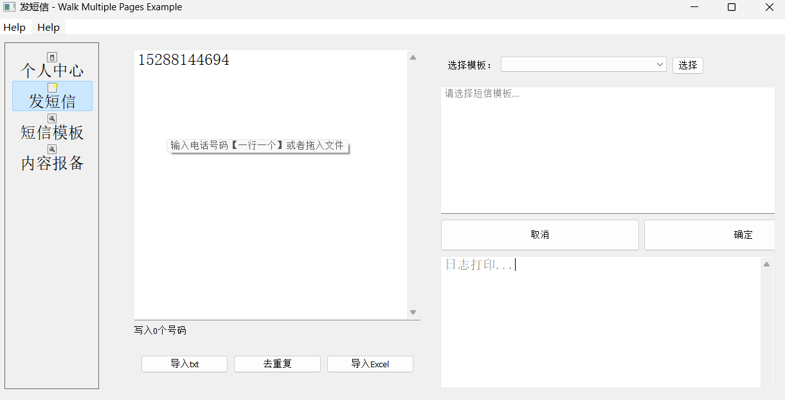

# go-SMS
批量发送短信工具（需要上传营业执照）。

# preview



# dev
- 用户登录注册验证码-- 阿里云
- 营销短信发送-- [互亿无线](https://www.ihuyi.com/demo/sms_marketing/go.html)
- 开发者登录验证

- 使用者登录验证
  - 既可以使用开发者的授权使用
    - 开发者授权费
  
  - 也可以自己申请appid自己使用
    自己申请产生软件买断费
    - 手机号登录
      - 验证码登录
        - 开发者收发验证码
      - 密码登录
    - 微信登录
      - 微信扫码
      - 微信授权
  - 支付宝支付接口开发
    - 先登录试用 再选择支付

- 发送短信业务
  - 读取发送列表
  - 号码查重
  - 短信模板
    - 云端审核模板内容
  - 确认发送

### 模块分析
## 短信业务
  - 短信发送
  - 签名报备
  - 模板报备
  - 发送队列
  - 发送记录
  - 回复记录
  - 充值记录
  - 发送统计
  - 设置
## 个人中心
  - 基本信息
    - 短信剩余条数
    - 签名 模板数量
  - 认证资料
  - 修改密码
## 充值消费
  - 我的订单
    - 订单号
    - 创建时间
    - 金额
    - 创建时间
    - 操作
  - 短信剩余条数
    - 充值
  - 签名 模板数量
### 后台操作功能
  1. 管理员登录
  2. 查看用户列表
  3. 给予用户封号
  4. 管理员审核商品
  5. 管理员分页展示各类商品信息 全部，已审核:1，待审核:3，违规:0 完成:4
  6. 管理员对商品的操作 违规:0 通过审核:1


- ui界面 [参考](https://www.ihuyi.com/demo/sms_marketing/go.html)

·速网科技    http://www.duanxin360.com/fangan/59.html
  | 套餐 | 条数 | 评分 | 期限 |
  | ---- | ---- | ---- | ---- |
  | 500元套餐 |	10000条 - 0条 |	5分	| 永久
  | 1000元套餐 |	20000条 - 1000条 |	4.7分	| 永久
  | 2500元套餐 |	50000条 - 5000条 |	4.5分	| 永久
  | 5000元套餐 |	100000条 - 25000条 |	4分 | 永久

· [达信通](http://www.dxtong.com/support/49.html)
<hr/>

> 1个汉字、1个字母、1个数字、1个符号都为一个字符，
> 短信字数＝短信模板内容字数 + 签名字数。
> *短信字数<=66个字，按照66个字一条短信计算；
> *短信字数>66个字，即为长短信。


·  [短信网](http://sms.duanxin.com/admin/index.html#/industry/send/routine)


### build
```sh
go get github.com/akavel/rsrc
go get github.com/lxn/walk
rsrc -manifest SMS.exe.manifest -ico "./data/img/stop.ico" -o rsrc.syso
go build -ldflags="-H windowsgui" -o ./bin/SMS.exe
```
